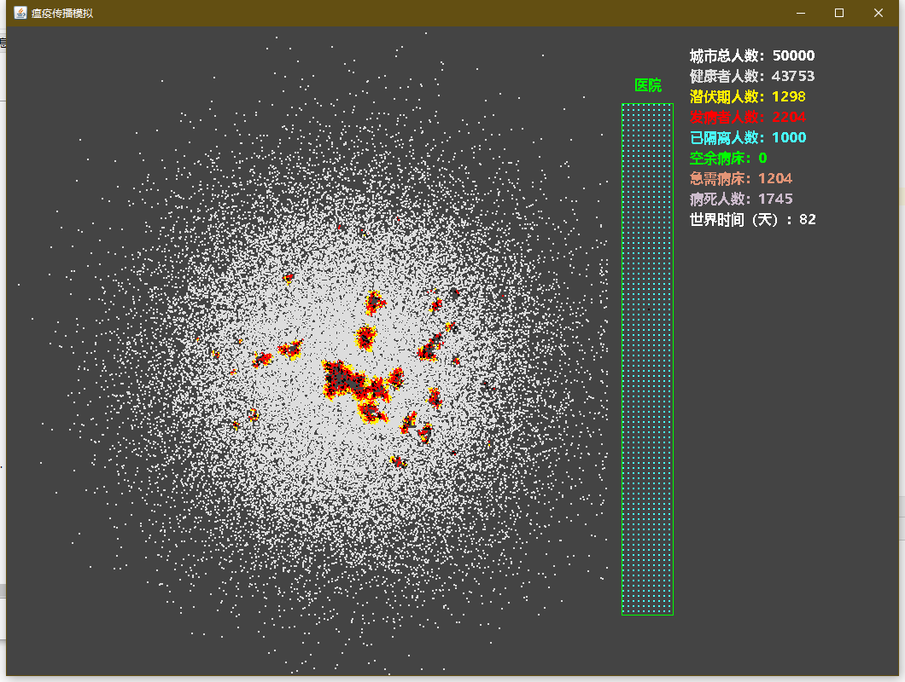
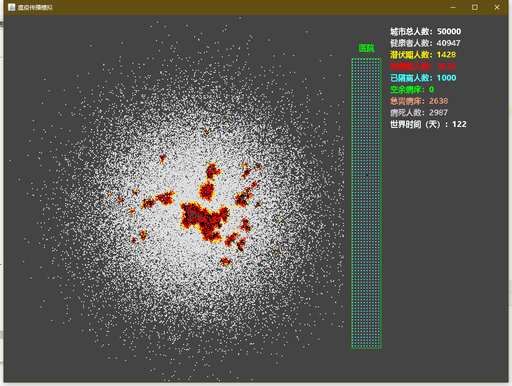

# VirusBroadcast
## 简介

一个基于java的模拟仿真程序，由于启动的时候时间仓促，数据不足，所以模型和推演过程过于简单，如果有好的想法或者能提供相关数据支持的朋友请提issues。
如果您也是一名java程序员，可以直接修改并给我提交pr，我之前已经启动每日疫情数据的每日抓取工作，希望在疫情结束后有机会通过这些精准的的数据做一个复盘。

2020.2.6:
病毒变异过程是一个不断适应的过程，可以尝试简单的DNN对病毒进行建模，已经开始着手实施。


## 图例






## 开发

当前暂未使用Maven或Gradle进行项目管理，可以直接使用IDEA-C导入项目。

导入方法可以参照 [本帖](https://github.com/KikiLetGo/VirusBroadcast/issues/1)


## 运行

以下方式适用于命令行玩家：

建议最低JDK版本: OpenJDK 8（推荐：AdoptOpenJDK）

 ```bash
 cd src;

 javac Main.java;
 
 java Main;
 ```

注意：Windows下除了配置java环境，还需要设置编码才行，编译命令：

```bash

javac -encoding UTF-8 Main.java // 当前目录生成系列class文件

java Main

```


## License

// TODO